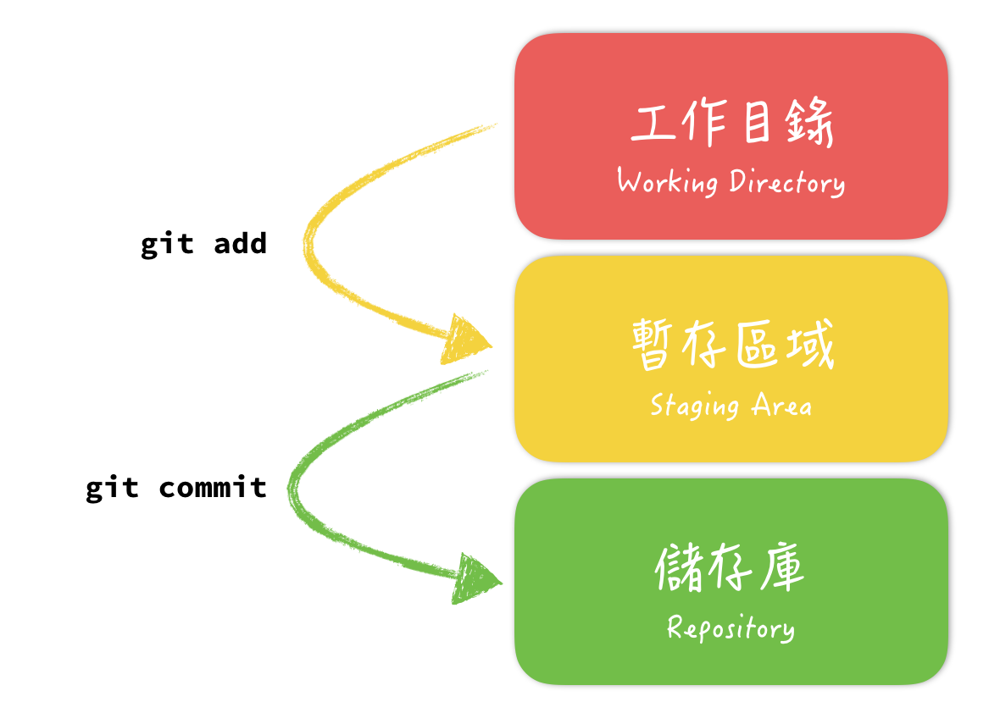

进入一个目录并使用`git init`使得Git对该目录进行版本控制(此时会创建一个.git目录，通过删除该目录会永久取消其控制功能
### 让Git管理文件
#### 创建文件并提交
1. 创建文件
```bash
$ git status
On branch master

No commits yet //没有文件在此目录

nothing to commit (create/copy files and use "git add" to track)

$ echo "hello,world" > hello.
$ git status                    
On branch master

No commits yet

Untracked files:
  (use "git add <file>..." to include in what will be committed)
	hello.txt

nothing added to commit but untracked files present (use "git add" to track)
```
2. 提交文件
```bash
$ git add hello.txt # 批量文件可以使用*.txt 等万用字元/通配符
$ git status       
On branch master

No commits yet

Changes to be committed:
  (use "git rm --cached <file>..." to unstage)
	new file:   hello.txt
```
广告：[重定向、管道符、通配符](https://0xffff.one/d/1150-linux-zhong-shell-de-shi-yong/4)
通过对比我们发现，Utracked变为了new file，这说明文件被放入了暂存区(Staging Area)
提交所有文件可以`git add --all`(有个和它功能相同的`git add.`)
 
3. 修改文件后要进行什么操作
我们对hello.txt进行修改，修改前的文件会保留在暂存区
```bash
$ echo "hello,git" >> hello.txt
$  git status
On branch master

No commits yet

Changes to be committed:
  (use "git rm --cached <file>..." to unstage)
	new file:   hello.txt

Changes not staged for commit:
  (use "git add <file>..." to update what will be committed)
  (use "git restore <file>..." to discard changes in working directory)
	modified:   hello.txt
```
修改文件后需要重新使用git add命令更新修改

4. 将暂存库内容提交到存储库存档
git add后进行git commit操作使其被永久保存
```bash
$ git commit -m "first commit" # -m "文字"用来备注改动,没有是默认不会完成Commit的
[master (root-commit) 07c311d] first commit
 1 file changed, 2 insertions(+)
 create mode 100644 hello.txt
```
`git commit --allow-empty -m "xxx"`可以无内容提交
先add再commit可以使得修改更有条理

#### 查看记录
`git log`
`git log --patch`显示提交差异`-p` ,后面加`-n` 限制显示数
`git log --stat`显示每次提交的简略信息
`git log --pretty` 它会使用不同于默认格式的方式展示提交历史记录，还有子选项可以使用`--pretty=<option>`
oneline short full fuller format graph
它们展示信息的格式基本一致，但是详尽程度不一
例子`git log --pretty=format:"%h %s" --graph`
展示的内容基本包含Commit的作者，时间，以及事件，也可以自定义，[详细可看此](https://git-scm.com/book/zh/v2/Git-%E5%9F%BA%E7%A1%80-%E6%9F%A5%E7%9C%8B%E6%8F%90%E4%BA%A4%E5%8E%86%E5%8F%B2)
查找作者可以加上`--author="Author1\|Author2"`(“\|”或者)，关键字可以加上`--grep="keyword"`(Commit信息)|`-S "content"`(已经Commit文件的内容)
